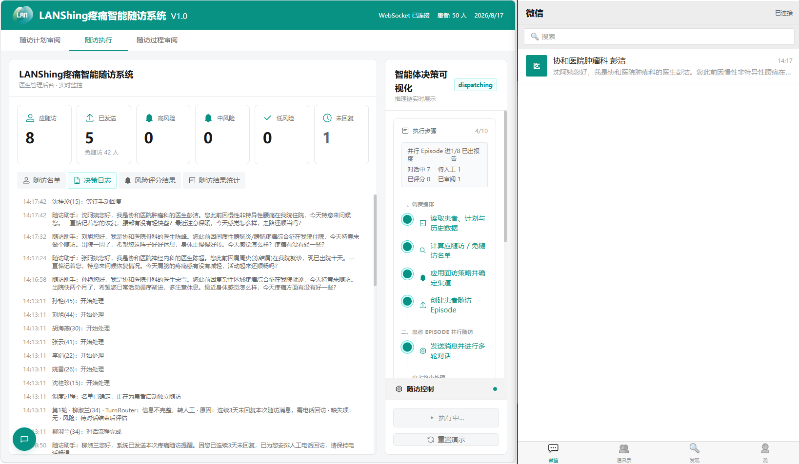

# LANShing 疼痛智能随访系统

基于 FastAPI、Vue 3、LangGraph 和 RAG 的疼痛随访演示系统。系统把一次随访拆成“总调度 + 患者 Episode + 能力 Agent + 医生审阅”几个明确边界，支持自动模拟患者和人工模拟患者并行运行。

## 项目介绍

LANShing 疼痛智能随访系统面向出院后的疼痛患者随访场景，用于展示多智能体协作的随访流程。系统从数据库读取患者和随访计划，判断当天是否应随访，为每名患者创建独立的随访会话，并通过 WebSocket 将消息、决策日志、风险和审阅结果实时推送到医护端。

系统支持以下核心场景：

- 自动患者：由 `PatientSimulatorAgent` 根据患者病情和对话上下文生成回复。
- 人工患者：等待医护在微信模拟页面中手动输入患者回复，不会自动弹出对话窗口。
- 信息采集：围绕疼痛评分、睡眠、用药和副作用等随访槽位进行理解、补问和收集。
- 风险识别：根据患者回复和结构化信息计算风险；出现绝望、剧烈痛苦等不稳定情绪时生成人工介入预警。
- 未回复处理：向连续未回复患者发送首条消息，记录完整随访过程，最后提示电话回访但不虚构患者评分。
- 过程审阅：每个患者的会话完成后生成 AI 审阅意见；总调度收齐全部患者报告后再展示本次统计结果。

本项目是演示系统，患者和病历数据为模拟数据，不能替代真实医疗系统或临床判断。

## 系统界面展示

以下为 LANShing 疼痛智能随访系统的随访执行界面展示：



## 从远程仓库克隆并运行

### 1. 克隆代码

```bash
git clone https://github.com/wuzhanbo1007/pain-follow-up-agent.git
cd pain-follow-up-agent
```

已有本地仓库时，在项目根目录同步远程代码：

```bash
git pull --ff-only
```

如果需要查看远程地址或当前分支：

```bash
git remote -v
git branch --show-current
```

### 2. 准备基础服务

后端运行需要：

| 服务 | 用途 | 是否必须 |
|---|---|---|
| Python 3.10+ | 后端与 Agent 工作流 | 必须 |
| Node.js 18+、npm | Vue 前端 | 必须 |
| MySQL 5.7+/8.x | 患者、计划、会话和审阅数据 | 必须 |
| Elasticsearch 8.x | RAG 混合检索 | 使用知识库时需要 |
| LLM / Embedding / Reranker | 对话生成和知识检索 | 未配置时可降级运行 |

先在 MySQL 中创建 `.env` 配置的数据库，例如：

```sql
CREATE DATABASE `pain-followup`
  CHARACTER SET utf8mb4
  COLLATE utf8mb4_unicode_ci;
```

### 3. 配置并启动后端

Windows PowerShell：

```powershell
cd pain-followup-demo/backend
python -m venv .venv
.\.venv\Scripts\Activate.ps1
python -m pip install -r requirements.txt
Copy-Item .env.example .env
# 编辑 .env，填写 MySQL、LLM 等实际配置
python app.py
```

macOS/Linux：

```bash
cd pain-followup-demo/backend
python3 -m venv .venv
source .venv/bin/activate
python -m pip install -r requirements.txt
cp .env.example .env
# 编辑 .env，填写 MySQL、LLM 等实际配置
python app.py
```

后端默认监听 `http://localhost:5000`。首次启动会读取运行配置、初始化应用上下文和数据库表；数据库为空时会按项目配置生成演示基础数据。

### 4. 启动前端

另开一个终端：

```bash
cd pain-followup-demo/frontend
npm install
npm run dev
```

前端默认地址为 `http://localhost:3000`：

- `http://localhost:3000/`：随访执行、决策日志、过程审阅和结果统计。
- `http://localhost:3000/chat.html`：患者微信对话模拟页面。

启动顺序建议为：先启动后端，再启动前端，最后在随访执行页面发起本次随访。

## 整体架构

系统采用“表现层、应用编排层、Agent 能力层、领域层、基础设施层、数据层”的分层结构。业务流程由工作流节点显式编排，单个能力 Agent 负责一个清晰任务，名单判定、覆盖度、风险和回访策略等确定性规则由领域服务负责。

```text
┌──────────────────────────────────────────────────────────────┐
│ 前端：DemoPage / ChatPage / 审阅 / 日志 / 统计 / WebSocket      │
└──────────────────────────────┬───────────────────────────────┘
                               │ REST + Socket.IO
┌──────────────────────────────▼───────────────────────────────┐
│ routes：患者、计划、dispatch、episode、审阅、知识库、WS 事件   │
└──────────────────────────────┬───────────────────────────────┘
                               │
┌──────────────────────────────▼───────────────────────────────┐
│ services：DispatchService / EpisodeService / DoctorReview     │
└──────────────────────────────┬───────────────────────────────┘
                               │ LangGraph
┌──────────────────────────────▼───────────────────────────────┐
│ Agent 工作流：Dispatcher / PatientFollowup / Conversation     │
│             PatientSimulator / Review / Planner               │
└───────────────┬──────────────────────┬────────────────────────┘
                │                      │
┌───────────────▼──────────────┐ ┌─────▼────────────────────────┐
│ 能力 Agent                   │ │ 领域规则与策略                │
│ 回复理解、覆盖度、路由、话术 │ │ 名单、风险、回访、槽位、状态  │
│ 情绪、模拟患者、AI 审阅      │ │ 确定性判断和安全护栏          │
└───────────────┬──────────────┘ └─────┬────────────────────────┘
                │                      │
┌───────────────▼──────────────────────▼────────────────────────┐
│ 基础设施：LLM Gateway、MySQL Repository、Checkpointer、Outbox │
│             Elasticsearch RAG、实时事件和日志                  │
└───────────────────────────────────────────────────────────────┘
```

### 一次随访的生命周期

```text
DispatcherAgent
  ├─ 读取数据库候选患者
  ├─ RosterDecider 判定当天应随访名单
  ├─ CallbackPolicy 标记连续未回复患者
  └─ 为每名患者创建一个独立 Episode

DispatchService 并行启动所有 Episode
  └─ PatientFollowupAgent
       ├─ 发送首条随访消息
       ├─ human：等待前端回复；simulator：调用患者模拟器
       ├─ ConversationAgent 处理每一轮回复
       │    ├─ ReplyUnderstandingAgent：结构化提取患者表达
       │    ├─ CoverageEvaluator：判断 pain_nrs 等信息是否收齐
       │    ├─ TurnRouter：继续追问、完成或转人工
       │    └─ Greeting/Question/Farewell Composer：生成医护回复
       ├─ RiskEvaluator：计算风险和人工预警
       ├─ 持久化会话、消息、风险与审阅快照
       └─ ReviewAgent：生成该患者的 AI 审阅意见和报告

DispatchService 收集全部 Episode 报告
  └─ 所有应随访患者结束后，前端才展示本次统计结果
```

### 调度与患者会话的关系

一次点击发起随访会生成一个唯一的 `dispatch_id`。总调度器根据当天应访名单创建多个患者 Episode，每个 Episode 使用独立的状态和会话标识，可以并行推进，不会因为某个手动患者等待回复而阻塞其他自动患者。

每个 Episode 完成后立即保存自己的会话和报告，但总调度只有在所有应访患者都产生终态报告后才完成。前端审阅页面和统计组件都按当前 `dispatch_id` 读取，避免重新加载时混入上一次运行的数据。

### 未回复患者

被电话回访策略标记的患者仍然会创建 Episode，并由随访助手发送一条首条消息；系统不会等待其回复。该患者的消息、会话、AI 审阅和报告都会进入随访过程审阅页面，风险评分显示为未评估，并提示“需要电话回访”。

### 人工模拟患者

配置为人工模式的患者不会自动弹出微信聊天窗口。医生点击患者后再打开对话；未打开前，列表展示原始医护消息内容，并按对话框单行高度截断显示。医护和患者消息都会写入决策日志。

## 统计与审阅时机

- 每个 Episode 完成后立即保存该患者的会话、风险、AI 审阅快照和报告。
- 随访过程审阅页面按当前 `dispatch_id` 读取数据，避免重新加载时混入上一次运行内容。
- 总调度器收齐本次所有 Episode 的终态报告后，才将 dispatch 标记为完成。
- 随访结果统计组件只有在“已完成报告数 = 应随访人数”后才展示结果，因此手动患者未结束时不会提前统计。

## 技术栈

| 层级 | 技术 | 用途 |
|---|---|---|
| 前端框架 | Vue 3 | 页面和组件开发 |
| 前端状态 | Pinia | 随访、消息、日志和审阅状态管理 |
| 前端构建 | Vite、Tailwind CSS | 开发服务器、构建和界面样式 |
| 实时通信 | Socket.IO | 后端向医护端推送消息、状态和日志 |
| 后端框架 | FastAPI | REST API 和 ASGI 应用 |
| 实时服务 | python-socketio | WebSocket/Socket.IO 服务端 |
| Agent 编排 | LangGraph | Dispatcher、Episode、Conversation、Review 工作流 |
| LLM 接口 | OpenAI 兼容 API、LangChain | 回复理解、话术生成、AI 审阅和模拟患者 |
| 数据校验 | Pydantic | 领域模型和结构化 LLM 输出校验 |
| 关系数据库 | MySQL、SQLAlchemy、PyMySQL | 患者、计划、会话、消息、风险和审阅持久化 |
| 知识库 | Elasticsearch | BM25、向量 kNN 和 RRF 混合检索 |
| 文档处理 | Unstructured、pypdf、Tesseract | PDF/Markdown/TXT 解析和 OCR |
| 向量与精排 | OpenAI 兼容 Embedding、Gitee 或本地 Reranker | RAG 向量生成和候选精排 |

LLM 不是每个流程节点的唯一判断来源。确定性业务规则由领域服务执行；LLM 主要用于自然语言理解、自然语言生成、患者模拟和 AI 审阅，并通过结构化模型和安全护栏约束输出。

## 配置文件

### `backend/.env`

复制 `backend/.env.example` 后配置本机环境。常用变量如下：

| 变量 | 作用 |
|---|---|
| `DB_HOST/DB_PORT/DB_USER/DB_PASSWORD/DB_NAME` | MySQL 业务数据库连接 |
| `LLM_API_KEY/LLM_BASE_URL/LLM_MODEL` | 对话 LLM；未配置时走降级逻辑 |
| `LLM_TIMEOUT/LLM_MAX_RETRIES` | LLM 超时和重试 |
| `API_HOST/API_PORT/API_DEBUG` | FastAPI 服务 |
| `EMBEDDING_*` | RAG 向量生成服务 |
| `ES_*` | Elasticsearch 地址、认证和索引 |
| `RERANKER_*` | 本地或 Gitee 精排服务 |
| `RETRIEVE_TOP_K/RRF_KEYWORD_WEIGHT` | 混合检索参数 |
| `DEMO_TODAY` | 必填的演示业务日期，格式为 `YYYY-MM-DD` |
| `PAINSMART_LOG_*` | 日志级别、文件和轮转参数 |

真实密钥和数据库密码只放在本机 `.env`，不要写入 README、`.env.example` 或提交到 Git。

### `backend/config/followup_runtime.yaml`

该文件用于医护可调整的运行规则：

- `manual_patient_ids`：人工模拟患者 ID；未列出的应访患者使用患者模拟器。
- `prefill_skip_ids`：启动预填充随访计划草稿时跳过的患者。
- `phone_callback_policy`：连续未回复天数和电话回访开关。
- `checkpointer`：`memory` 用于演示；跨进程恢复可配置 `postgres` 及 DSN。

业务日期仍以 `.env` 的 `DEMO_TODAY` 为准，并应与演示数据日期保持一致。

## 目录结构

```text
pain-followup-demo/
├─ backend/
│  ├─ app.py                         # FastAPI + Socket.IO 入口
│  ├─ agents/                        # Dispatcher、Episode、Conversation、Review 等 Agent
│  ├─ agents/capability_agents/      # 回复理解、覆盖度、路由、话术、模拟器等能力
│  ├─ services/                      # 调度、Episode、医生审阅门面
│  ├─ domain/                        # 领域模型、覆盖度、风险、名单和回访策略
│  ├─ infrastructure/                # MySQL、LangGraph、LLM、消息和实时事件适配
│  ├─ routes/                        # REST 与 Socket.IO 事件
│  ├─ prompts/                       # 各能力 Agent 的提示词模板
│  ├─ knowledge/                     # 文档解析、Embedding、ES 混合检索和精排
│  ├─ config/followup_runtime.yaml   # 随访运行规则
│  ├─ .env.example                   # 环境变量模板
│  ├─ requirements.txt               # 运行依赖
│  └─ requirements-dev.txt           # 可选开发依赖
├─ frontend/
│  ├─ src/pages/DemoPage.vue         # 随访执行与结果统计
│  ├─ src/pages/ChatPage.vue         # 患者微信对话模拟
│  └─ src/components/                # 审阅、日志、统计等组件
└─ knowledge_base/raw/               # RAG 原始 PDF/Markdown/TXT 语料
```

## 数据库与知识库

首次使用前确保 `.env` 中 MySQL 可连接。需要重新生成基础患者数据时，在 backend 目录执行：

```bash
python -m data.seed_mysql --patients 50
```

`--reset` 会清空并重建演示数据，使用前请确认连接的是演示库：

```bash
python -m data.seed_mysql --reset
```

知识库入库与状态检查：

```bash
python -m knowledge.ingest
python -m knowledge.ingest --status
```

LLM、Embedding、Reranker 或 Elasticsearch 不可用时，随访主流程仍可使用规则/模板降级；需要 RAG 计划生成或知识检索时，必须补齐相应服务配置。

## 版权与数据说明

演示患者为模拟数据，不应作为真实医疗建议。`knowledge_base/raw` 中的指南、共识和内部材料应保留来源及版权信息，仅在获得授权的范围内用于内部检索和医生辅助审阅。
